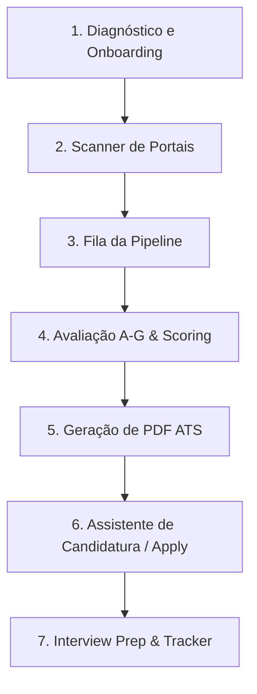

# 🧭 career-ops-navigator

<div align="center">

[](LICENSE)
[](https://github.com/santifer/career-ops.git)
[](#-compatibilidade-multi-cli)

**Navegador e Assistente Interativo de Workflow para o [career-ops](https://github.com/santifer/career-ops.git)**

*Elimine a necessidade de memorizar dezenas de scripts `npm`, subcomandos e a ordem correta do seu funil de candidatura.*

</div>

---

## 💡 O que é o `career-ops-navigator`?

O **`career-ops-navigator`** é uma skill universal de IA que funciona como um **piloto automático instrucional** para a ferramenta [career-ops](https://github.com/santifer/career-ops.git).

Ela traduz qualquer desejo em linguagem natural do usuário (ex: *"quero achar vagas de IA"*, *"como me me preparo para a entrevista?"*, *"qual comando rodar agora?"*) diretamente nos **comandos, scripts e ordens operacionais corretas** para o seu CLI de IA preferido.

---

## 🔗 Ferramenta Base

Esta skill é um complemento para a ferramenta principal **career-ops**:

- 📌 **Repositório do career-ops:** [https://github.com/santifer/career-ops.git](https://github.com/santifer/career-ops.git)
- 📌 **Repositório desta Skill:** [https://github.com/wellingtonspdev/career-ops-navigator.git](https://github.com/wellingtonspdev/career-ops-navigator.git)

---

## ⚡ Instalação Rápida (Global)

Você pode instalar a skill globalmente no seu sistema com apenas um comando:

### Windows (PowerShell):
```powershell
irm https://raw.githubusercontent.com/wellingtonspdev/career-ops-navigator/main/install.ps1 | iex
```
*(ou clone o repositório e execute `.\install.ps1`)*

### Linux / macOS (Bash):
```bash
curl -fsSL https://raw.githubusercontent.com/wellingtonspdev/career-ops-navigator/main/install.sh | bash
```

---

## 💻 Compatibilidade Multi-CLI (Passo a Passo)

A skill já vem pré-configurada para todos os CLIs de IA modernos. Basta abrir o terminal na pasta do seu projeto **career-ops**:

### 1. Antigravity CLI (`agy`)
- **Instalação Local:** Copie a pasta da skill para `.agents/skills/career-ops-navigator/`.
- **Como usar:**
  ```text
  /career-ops-navigator
  ```
  ou em linguagem natural:
  ```text
  "Como usar o career-ops para achar novas vagas?"
  ```

### 2. Claude Code (`claude`)
- **Instalação Local:** Copie para `.claude/skills/career-ops-navigator/`.
- **Como usar:**
  ```text
  /career-ops-navigator
  ```
  ou pergunte ao Claude:
  ```text
  "Qual a ordem correta para me candidatar a uma vaga no career-ops?"
  ```

### 3. OpenAI Codex CLI (`codex`)
- **Instalação Local:** Copie para `.codex/skills/career-ops-navigator/`.
- **Como usar:**
  No terminal interativo do Codex:
  ```text
  Execute o workflow de busca de vagas com a skill career-ops-navigator
  ```

### 4. OpenCode & Outros CLIs Agentic
- **Instalação Local:** Copie para `.agents/skills/career-ops-navigator/`.
- **Como usar:**
  ```text
  "Quero me preparar para a entrevista da empresa X usando a skill career-ops-navigator"
  ```

### 5. GitHub Copilot CLI
- **Instalação Local:** Copie para `.github/skills/career-ops-navigator/`.
- **Como usar:**
  ```text
  @career-ops-navigator o que devo fazer agora no meu funil?
  ```

---

## 🗺️ Matriz de Intenções (O que você pode pedir)

| O que você quer fazer? | A Skill fará automaticamente: |
|---|---|
| 🏁 **Configurar / Onboarding** | Diagnosticar o repositório (`npm run doctor`), orientar criação do `cv.md` e `profile.yml` sem inventar fatos. |
| 🔍 **Buscar Vagas (Scan)** | Validar portais (`npm run validate:portals`) e executar o scanner (`npm run scan -- --verify`). |
| ⚡ **Avaliar Lote de Vagas** | Executar o processador de pipeline (`/career-ops pipeline`) para analisar relatórios pendentes. |
| 🎯 **Avaliar 1 Vaga Específica** | Extrair JD da URL, checar se está ativa, rodar auto-pipeline (Blocos A-G) e gerar relatório em `reports/`. |
| 📄 **Gerar Currículo ATS (PDF)** | Gerar PDF estilizado e otimizado na pasta `output/` (`/career-ops pdf`). |
| 📝 **Assistente de Formulação (Apply)** | Mapear formulário da vaga e rascunhar respostas personalizadas sem submeter sem sua aprovação. |
| 🎤 **Preparar para Entrevista** | Montar treino de histórias STAR e preparar perguntas específicas (`/career-ops interview-prep`). |
| 📊 **Ver Métricas do Tracker** | Exibir saúde e status da pipeline (`npm run verify` ou `/career-ops tracker`). |

---

## 🔄 Fluxo Completo Recomendado (Workflow 1 a 7)



1. **Diagnóstico Inicial:** `npm run doctor`
2. **Varredura:** `npm run scan -- --verify`
3. **Avaliação Automatizada:** `/career-ops pipeline` ou `/career-ops {URL}`
4. **Exportação:** `/career-ops pdf`
5. **Candidatura Segura:** `/career-ops apply` (Sempre *Human-in-the-Loop*)

---

## 🛡️ Regras e Salvaguardas Éticas

- 🛑 **Sem Envio Automático:** A skill **NUNCA** envia candidaturas ou e-mails sem sua confirmação explícita.
- 📌 **Veracidade Garantida:** Fatos profissionais são extraídos **apenas** do seu `cv.md` e `profile.yml`. Nada é inventado.
- 🔒 **Privacidade Local:** Todas as análises rodam localmente no seu ambiente.

---

## 📄 Licença

Distribuído sob a licença MIT. Veja `LICENSE` para mais informações.
